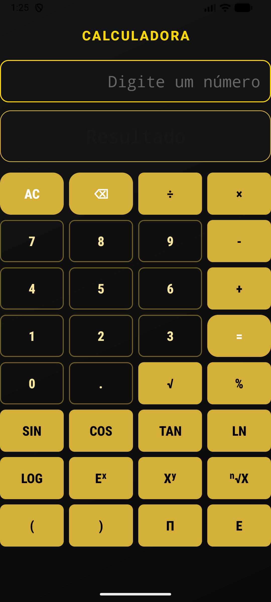

# 🧮 Calculator App: Precision & Minimalist Arithmetic System

A modern, high-performance calculation tool for Android, built with **Kotlin** and **Material 3** for a seamless and elegant user experience.

---

## 📖 Description

This **Calculator App** is a sleek mobile solution designed for rapid mathematical computations and a refined digital experience. Developed using the latest Android standards, it provides a streamlined interface for everyday arithmetic and advanced scientific operations, ensuring accuracy and speed.

The system focuses on **Optimal Resource Management**—ensuring the app remains lightweight and responsive, featuring a premium **"Gold & Dark"** aesthetic that prioritizes readability and user focus.

---

## 📸 App Visuals

Below is the visual identity and primary interface of the application, showcasing the minimalist "Gold & Dark" design.

### 🔹 App Icon
The official brand identity for the application.


### 🔹 App Interface & Functionality
The main dashboard featuring the full range of arithmetic and scientific operations.


---

## 🚀 Features

* **Dynamic Arithmetic Engine:** Performs real-time calculations with high precision and instant feedback.
* **Scientific Capabilities:** Support for advanced functions including `SIN`, `COS`, `TAN`, `LOG`, `LN`, and powers/roots (`Xʸ`, `ⁿ√X`).
* **Material 3 Design:** Built with the latest M3 components, featuring a custom gold-on-black aesthetic.
* **Optimized Layout:** Utilizes `ConstraintLayout` for a responsive grid that adapts to various screen sizes.
* **Lightweight Performance:** Zero-lag input response, optimized for minimum battery and memory consumption.

---

## 🛠 Tech Stack

| Component | Specification |
| :--- | :--- |
| **Language** | Kotlin |
| **Minimum SDK** | API 24 (Android 7.0+) |
| **UI Framework** | Material Design 3 (M3) |
| **Layout Engine** | ConstraintLayout 2.1.4 |
| **Theme System** | DayNight.NoActionBar (Custom Gold Palette) |

---

## ⚙️ Installation & Usage

### 1. Clone the repository
```bash
git clone [https://github.com/Ediko-eng/Calculator-App.git](https://github.com/Ediko-eng/Calculator-App.git)
cd Calculator-App
